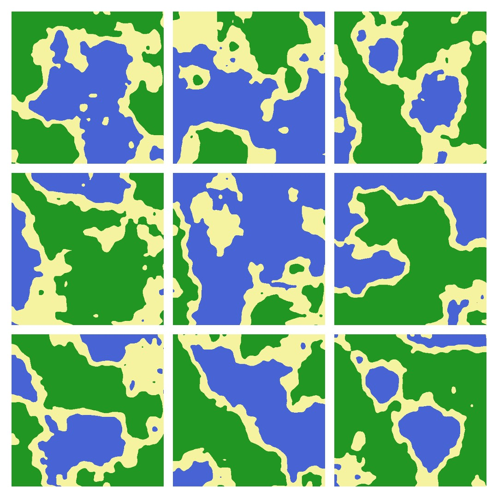

# Random-Map-Generator
A procedural terrain/map generator that constructs a unique map by using the Perlin noise algorithm, displays the map visually with p5.js, a JavaScript library used to create visuals

Directions:
Go to https://editor.p5js.org/ and paste the code from sketch.js and press the play button to run the algorithm and generate a new map

More information on Perlin noise and related topics:
- https://en.wikipedia.org/wiki/Perlin_noise
- https://en.wikipedia.org/wiki/Procedural_generation
- https://en.wikipedia.org/wiki/Pseudorandomness